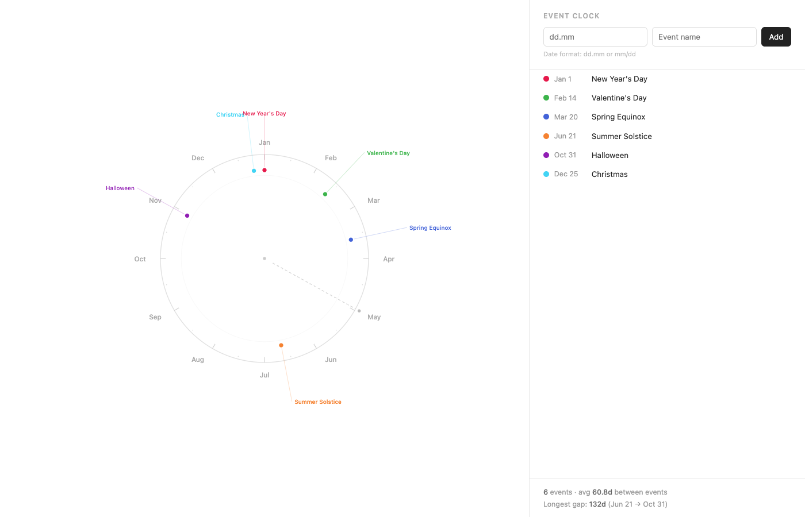

# Event Clock

A yearly event visualizer that displays recurring dates on a circular clock face.

## Usage

Open `index.html` in a browser — no build step or server required.

- **Add events** by entering a date (`dd.mm` or `mm/dd`) and a name
- **Click a dot** on the clock to highlight the event in the list
- **Hover** a list item to enlarge its dot on the clock
- **Change color** by clicking the color dot next to an event
- **Rename** via the edit button, **delete** via the ✕ button

Events are stored in `localStorage` and persist across sessions.